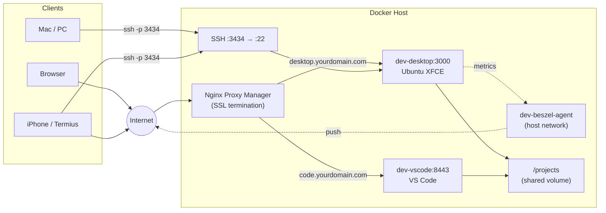

# Cloud Dev Stack

A Docker Compose stack that gives you a complete, persistent cloud development environment — Ubuntu desktop, VS Code, and SSH, all sharing the same files.

```bash
curl -fsSL https://raw.githubusercontent.com/Piero24/Cloud-Dev-Desktop/main/install.sh | bash
```

## What's inside

| Service | Image | Purpose |
|---------|-------|---------|
| **desktop** | `linuxserver/webtop:ubuntu-xfce` | Full Ubuntu XFCE desktop in your browser + SSH |
| **vscode** | `linuxserver/code-server:latest` | VS Code in your browser, same `/projects` folder |
| **beszel-agent** | `henrygd/beszel-agent:latest` | System metrics → your existing Beszel hub |

Pre-installed: nvm + Node LTS, Claude Code, build-essential, Python, Java, Docker CLI, tmux, zsh.

## Quickstart

### CasaOS

```bash
curl -fsSL https://raw.githubusercontent.com/Piero24/Cloud-Dev-Desktop/main/install.sh | bash
```

The installer asks where to store data, downloads the compose file and init script, then prints next steps.

### Plain Docker

```bash
# 1. Clone
git clone https://github.com/Piero24/Cloud-Dev-Desktop.git
cd Cloud-Dev-Desktop

# 2. Create the NPM network
docker network create npm-network

# 3. Edit values
nano compose.yaml   # CHANGE_ME_USERNAME, CHANGE_ME_WEB_PASSWORD, CHANGE_ME_SUDO_PASSWORD

# 4. Start
docker compose up -d
```

## Architecture



Both containers mount the same `/projects` directory — edit a file anywhere, see it everywhere.

## Key features

- **Custom username** — set `CUSTOM_USER` in the compose file, no more `abc`
- **Persistent sessions** — tmux auto-attach from iPhone/Termius via `TMUX_AUTO=1` env var; sessions survive disconnects
- **Configurable cleanup** — `TMUX_TIMEOUT` auto-kills detached sessions after N hours; `tmux-keep` overrides it
- **Persistent packages** — everything in `/config` survives container rebuilds (nvm, Node, Claude Code, pip packages, npm globals)
- **No Mac required** — work entirely from a browser and SSH; optional Mac-side rsync sync documented
- **Monitoring** — Beszel agent feeds system metrics to your existing hub

## Files

| File | Purpose |
|------|---------|
| [`compose.yaml`](compose.yaml) | Plain Docker Compose (short syntax, relative paths) |
| [`compose-casaos.yaml`](compose-casaos.yaml) | CasaOS Compose (long syntax, `x-casaos` metadata) |
| [`init.sh`](init.sh) | Container boot script — installs SSH, nvm, Node, Claude Code, tmux |
| [`install.sh`](install.sh) | Interactive installer — downloads files and sets up directories |

## Docs

Full documentation at [`cloud-dev-docs/`](cloud-dev-docs/):

- [Server Setup](cloud-dev-docs/docs/server-setup.mdx) — plain Docker setup
- [Server Setup (CasaOS)](cloud-dev-docs/docs/server-setup-casaos.mdx) — CasaOS import setup
- [Mac-Side Setup](cloud-dev-docs/docs/mac-setup.mdx) — optional Mac SSH + rsync config
- [Daily Workflow](cloud-dev-docs/docs/daily-workflow.mdx) — tmux, persistent sessions, Termius
- [Tips & Troubleshooting](cloud-dev-docs/docs/tips.mdx)

## Requirements

- Docker + Docker Compose
- Nginx Proxy Manager with an `npm-network` (or adjust the network config)
- A domain name with DNS pointing to your server (for SSL via NPM)
- Optional: [Beszel hub](https://github.com/henrygd/beszel) running elsewhere (for the agent)

## License

MIT — see [LICENSE](LICENSE).
