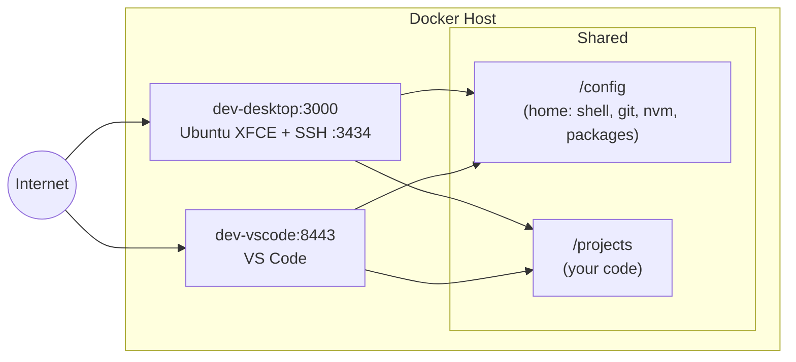

<p align="center">
  
</p>

<p align="center">
  <a href="https://github.com/Piero24/Cloud-Dev-Desktop/blob/main/LICENSE"></a>
  <a href="https://www.docker.com/"></a>
  <a href="https://casaos.io/"></a>
  <a href="#"></a>
</p>

# Cloud Dev Stack

One environment, two browser based views. A Docker Compose stack that gives you a complete, persistent cloud development workspace with Ubuntu desktop, VS Code, and SSH, all sharing the same home directory and files.

```bash
curl -fsSL https://raw.githubusercontent.com/Piero24/Cloud-Dev-Desktop/main/install.sh | bash
```

## What's inside

| Service | Image | Purpose |
|---------|-------|---------|
| **desktop** | `linuxserver/webtop:ubuntu-xfce` | Full Ubuntu XFCE desktop + SSH + code-server + VS Code desktop app |
| **vscode** | `linuxserver/code-server:latest` | VS Code in your browser, same home + files |
| **beszel-agent** | `henrygd/beszel-agent:latest` | System metrics → your existing Beszel hub |

Both containers share `/config` (home directory) and `/projects`. Install a package or change a setting, it appears in both instantly. The vscode container is a browser based editor view into the same environment.

Pre installed: nvm + Node LTS, Claude Code, code-server, VS Code (desktop app), build-essential, Python, Java, Docker CLI, tmux, zsh.

## Architecture



## Quickstart

### CasaOS

```bash
curl -fsSL https://raw.githubusercontent.com/Piero24/Cloud-Dev-Desktop/main/install.sh | bash
```

The installer asks where to store data, downloads everything, then prints next steps.

### Plain Docker

```bash
git clone https://github.com/Piero24/Cloud-Dev-Desktop.git
cd Cloud-Dev-Desktop

# Edit values in compose.yaml, then:
docker compose up -d
```

## Key features

- **One environment, two views**: both containers share `/config` (home) and `/projects`. Same shell, git, nvm, packages everywhere
- **Persistent sessions**: tmux auto attach from iPhone/Termius via `TMUX_AUTO=1`; sessions survive disconnects
- **Configurable cleanup**: `TMUX_TIMEOUT` auto kills detached sessions after N hours; `tmux-keep` overrides it
- **Persistent packages**: everything in `/config` survives container rebuilds
- **No Mac required**: work entirely from a browser and SSH
- **Monitoring**: Beszel agent feeds system metrics to your existing hub

## Files

| File | Purpose |
|------|---------|
| [`compose.yaml`](compose.yaml) | Plain Docker Compose (short syntax, relative paths) |
| [`compose-casaos.yaml`](compose-casaos.yaml) | CasaOS Compose (long syntax, `x-casaos` metadata) |
| [`init.sh`](init.sh) | Desktop container boot script. SSH, nvm, Node, Claude Code, code-server |
| [`init.d/99-vscode-env.sh`](init.d/99-vscode-env.sh) | VSCode container boot script. Shared extensions |
| [`install.sh`](install.sh) | Interactive CasaOS installer |

## Docs

Full documentation at [`cloud-dev-docs/`](cloud-dev-docs/):

- [Overview & Architecture](cloud-dev-docs/docs/index.mdx)
- [Server Setup](cloud-dev-docs/docs/server-setup.mdx): Docker or CasaOS (single page with tabs)
- [Local Setup](cloud-dev-docs/docs/local-setup.mdx): optional local editing with auto sync
- [Daily Workflow](cloud-dev-docs/docs/daily-workflow.mdx): tmux, persistent sessions, Termius
- [Persistence & Kill Switch](cloud-dev-docs/docs/persistence.mdx)
- [Environment Variables](cloud-dev-docs/docs/env-vars.mdx): full reference
- [Tips & Troubleshooting](cloud-dev-docs/docs/tips.mdx)

## Requirements

- Docker + Docker Compose
- Optional: [Beszel hub](https://github.com/henrygd/beszel) running elsewhere (for the agent)

## License

MIT. See [LICENSE](LICENSE).
