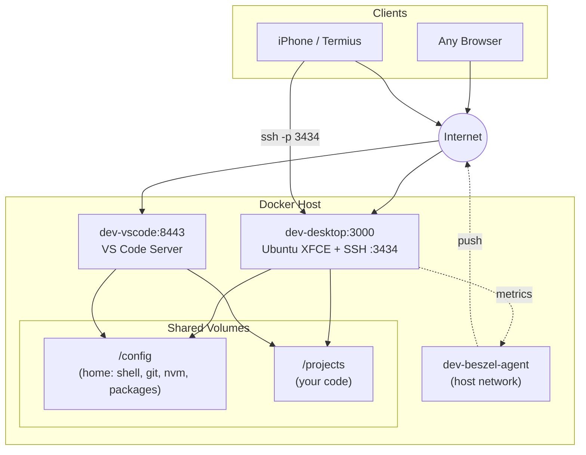

# Cloud Dev Stack

A complete, persistent cloud development environment — one shared workspace, two browser-based views.

## What You Get

- **Ubuntu desktop in your browser** — full XFCE desktop from any device
- **VS Code in your browser** — same files, same tools, same environment
- **SSH access** — connect from Mac, PC, or phone (iPhone/Termius with persistent tmux)
- **Everything shared** — both containers mount the same `/config` (home) and `/projects`. Install a package, set a git config, or save a file — it's visible everywhere instantly

## Architecture

Two containers, one environment. They share `/config` (home directory) and `/projects` — the vscode container is a browser-based editor view into the same workspace:



## How it works

```
compose.yaml          init.sh              /config (shared home)
(desktop service)  →  on boot  →          ├── .bashrc / .zshrc
                                          ├── .gitconfig
                                          ├── .nvm (Node LTS)
                                          ├── .npm-global (Claude Code)
                                          └── .local/share/code-server
                                                     ↓
                                          vscode container mounts
                                          same /config — same everything
```

Edit `compose.yaml` → recreate desktop → both containers see the change.

## Shared environment

| What | Where | Shared? |
|------|-------|---------|
| Shell config (PATH, aliases) | `/config/.bashrc` | ✅ Both containers |
| Git identity + GitHub token | `/config/.gitconfig` | ✅ Both containers |
| nvm + Node LTS | `/config/.nvm` | ✅ Both containers |
| Claude Code | `/config/.npm-global` | ✅ Both containers |
| VS Code extensions | `/shared/code-server/extensions` | ✅ Both containers |
| Your projects | `/projects` | ✅ Both containers |
| Persistent sessions (tmux) | Desktop only | Desktop (via SSH) |

## Tools pre-installed

| Tool | Installed by | Persists? |
|------|-------------|-----------|
| nvm + Node LTS | Init script | ✅ `/config/.nvm` |
| Claude Code | Init script (npm global) | ✅ `/config/.npm-global` |
| code-server | Init script | ✅ system install |
| build-essential (gcc, make) | Init script (apt) | ❌ Reinstalled each boot |
| python3 + pip | Init script (apt) | ❌ Reinstalled each boot |
| Docker CLI | Init script (apt) | ❌ Reinstalled each boot |
| Git, curl, zsh, tmux, nano | Init script (apt) | ❌ Reinstalled each boot |

:::tip[The golden rule]
If it lands in `/config`, it persists forever and appears in both containers. If it needs `sudo` or `apt`, add it to the init script.
:::

## Next steps

- **[Server Setup](./server-setup)** — get the stack running (Docker or CasaOS)
- **[Mac-Side Setup](./mac-setup)** — optional: edit locally, auto-sync to server
- **[Daily Workflow](./daily-workflow)** — tmux, persistent sessions, Termius
- **[Environment Variables](./env-vars)** — full reference for all configurable vars
