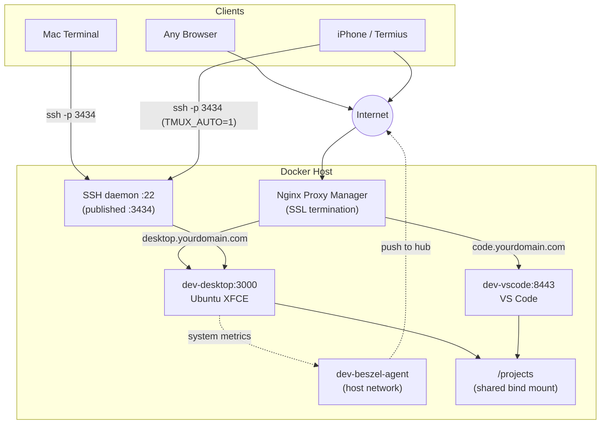
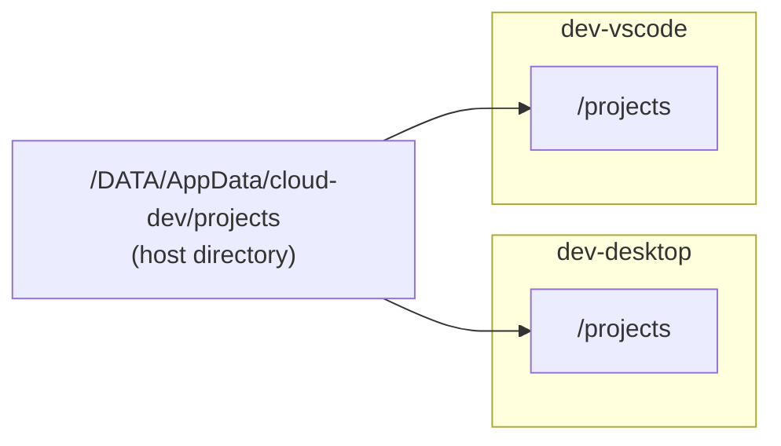

# Overview & Architecture

Cloud Dev Stack is a two-container Docker Compose stack for CasaOS that gives you a complete cloud development environment.

## What You Get

- **Browser-accessible Ubuntu desktop** — full XFCE desktop from any device
- **Browser-accessible VS Code** — on a separate port
- **SSH access** — so your Mac can edit files directly on the server
- **Full bidirectional sync** — edit locally, changes push to the server automatically via rsync (including deletions)
- **Persistent environment** — all user-installed packages, tools, and configs survive container rebuilds

Each app has its own login password. Access is routed through Nginx Proxy Manager with Let's Encrypt SSL.

## Architecture

## Shared Storage

Both containers mount the same host directory:

A file saved via SSH, web VS Code, or the Ubuntu desktop is instantly visible everywhere — it's the same bytes on disk.

## How Sync Works

1. You edit files on your Mac's local hard drive
2. VS Code autosaves on focus change (when you click away from a file)
3. The "Run on Save" extension fires `rsync --delete` through the already-open SSH tunnel
4. rsync compares local vs server — only changed files transfer
5. If you deleted a file locally, it's deleted on the server too (`--delete`)
6. No password prompt, no 2FA — rsync rides the SSH ControlMaster socket

## Tools Included

| Tool | Installed by | Persists? |
|------|-------------|-----------|
| nvm + Node LTS | Init script | ✅ `/config/.nvm` |
| Claude Code | Init script (npm global) | ✅ `/config/.npm-global` |
| build-essential (gcc, make) | Init script (apt) | ❌ Reinstalled each boot |
| python3 + pip | Init script (apt) | ❌ Reinstalled each boot |
| Docker CLI | Init script (apt) | ❌ Reinstalled each boot |
| Git, curl, zsh | Init script (apt) | ❌ Reinstalled each boot |

:::tip[The golden rule]
If it lands in `/config`, it survives forever. If it needs `sudo` or `apt`, add it to the init script.
:::
